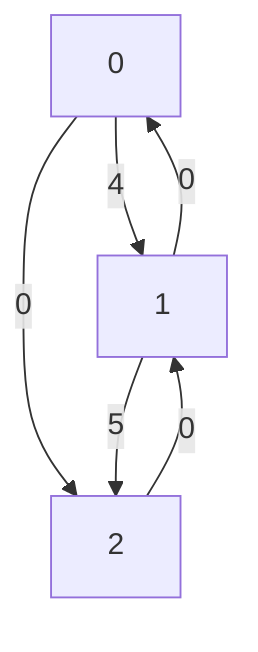

elkai - a Python 3 TSP solver
====

elkai is a Python 3 library for solving [travelling salesman problems](https://en.wikipedia.org/wiki/Travelling_salesman_problem) without external dependencies,
based on [LKH](http://akira.ruc.dk/~keld/research/LKH/) by
Keld Helsgaun.

💾 **To install it** run `pip install elkai`

💻 **Supported platforms:** elkai is available on Windows, Linux, OS X for Python 3.5 and above as a binary wheel.

[](https://github.com/fikisipi/elkai/actions/workflows/python-app.yml)
[](https://pypi.org/project/elkai/)

Example usage 
----------

```python
import numpy as np
import elkai

M = np.zeros((3, 3), dtype=int)
M[0, 1] = 4
M[1, 2] = 5

solution = elkai.solve_int_matrix(M)

print(solution)
# Output: [0, 2, 1]
```



Documentation
-------------


**elkai.solve_int_matrix(matrix: List[List[int]], runs=10) -> List**

* `matrix` is a list of lists or **2D numpy array** containing the distances between cities
* `runs` is the solver iteration count

An example matrix with 3 cities would be:

```python
[                 # cities are zero indexed, d() is distance
   [0, 4,  3],    # d(0, 0), d(0, 1), d(0, 2)
   [4, 0, 10],    # d(1, 0), d(1, 1), ...
   [2, 4,  0]     # ... and so on
]
```

And the output would be `[0, 2, 1]` because it's best to visit `first city => third city => second city`


**elkai.solve_float_matrix(matrix: List[List[float]], runs=10) -> List** same behaviour as above, with floats supported.

FAQ
----------------------

**How to manually build the library?**

You need CMake, a C compiler and Python 3.5+. You need to install the dev dependencies first: `pip install scikit-build ninja`. To build and install, run `python setup.py install`.

**How accurately does it solve asymmetric TSP problems?**

Instances with known solutions, which are up to N=315 cities, [can be solved optimally](http://akira.ruc.dk/~keld/research/LKH/Soler_ATSP_results.html).

**What's the difference between LKH and elkai?**

elkai packages the C LKH code into a nicer C library and then wraps it and compiles it into a Python wheel. **Note:** Dr. Helsgaun has released the LKH project for non-commercial use only, so elkai as a derivative work must be used this way too.

**Does it lock the GIL during a run?**

Yes.
