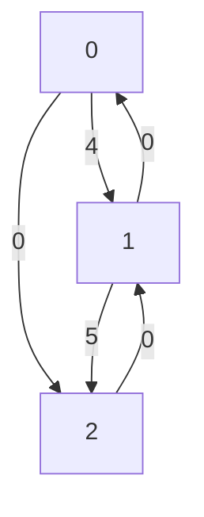

#  elkai - a Python library for solving TSP problems

[elkai](https://pypi.org/project/elkai/) is a Python 3 library for solving [travelling salesman problems](https://en.wikipedia.org/wiki/Travelling_salesman_problem):

* based on [LKH](http://akira.ruc.dk/~keld/research/LKH/) by Keld Helsgaun, with proven optimal solutions up to N=315
* running fast native code with prebuilt wheels for most platforms
* supports asymmetric distances (ATSP)

* cleaner API and more accurate results than [Google's OR tools](https://developers.google.com/optimization/routing/tsp)

[](https://github.com/fikisipi/elkai/actions/workflows/python-app.yml)
[](https://pypi.org/project/elkai/)

## Example usage 

```python
import elkai

distance_matrix = [
    [0, 4, 0],
    [0, 0, 5],
    [0, 0, 0]
]

cities = elkai.solve(distance_matrix, skip_end=False)

print(cities)
# Output: [0, 2, 1, 0]
```



> **Note**
> [solve_int_matrix](https://github.com/fikisipi/elkai/blob/55187e83e7d91ee597b408c8644632fb0ef2687f/elkai/__init__.py#L33) and [solve_float_matrix](https://github.com/fikisipi/elkai/blob/55187e83e7d91ee597b408c8644632fb0ef2687f/elkai/__init__.py#L38) are deprecated in v1.

## Installation

💾 **To install it** run `pip install elkai`

## Notes

⚠️ elkai takes the **global interpreter lock (GIL)** during the solving phase which means two threads cannot solve problems at the same time. If you want to run other workloads at the same time, you have to run another process - for example by using the `multiprocessing` module.

The LKH native code by Helsgaun is released for non-commercial use only. Therefore the same restriction applies to elkai, which is explained in the `LICENSE` file. If there isn't a prebuilt wheel for your platform, you'll have to follow the `scikit-build` process.