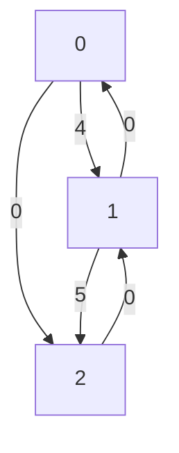

# elkai - A Python solver for the Travelling Salesman Problem / TSP

elkai is a Python 3 library for solving [travelling salesman problems](https://en.wikipedia.org/wiki/Travelling_salesman_problem):

* ⚡ running fast native code
* 🗺️ based on [LKH](http://akira.ruc.dk/~keld/research/LKH/) by Keld Helsgaun, with proven optimal solutions up to N=315
* 🛣️ supports asymmetric distances (ATSP)

## Installation

💾 **To install it** run `pip install elkai`

[](https://github.com/fikisipi/elkai/actions/workflows/python-app.yml)
[](https://pypi.org/project/elkai/)

Example usage 
----------

```python
import numpy as np
import elkai

M = np.zeros((3, 3), dtype=int)
M[0, 1] = 4
M[1, 2] = 5

solution = elkai.solve_int_matrix(M)

print(solution)
# Output: [0, 2, 1]
```



Documentation
-------------


**elkai.solve_int_matrix(matrix: List[List[int]], runs=10) -> List**

* `matrix` is a list of lists or **2D numpy array** containing the distances between cities
* `runs` is the solver iteration count

An example matrix with 3 cities would be:

```python
[                 # cities are zero indexed, d() is distance
   [0, 4,  3],    # d(0, 0), d(0, 1), d(0, 2)
   [4, 0, 10],    # d(1, 0), d(1, 1), ...
   [2, 4,  0]     # ... and so on
]
```

So, the output would be `[0, 2, 1]` because it's best to visit `0 => 2 => 1 => 0`.

⚠️ The final return to the start is implied and **is NOT** part of the output list, i.e. `len(output) == N`

----

**elkai.solve_float_matrix(matrix: List[List[float]], runs=10) -> List**

Same behaviour as above, with float distances supported. Note that there may be precision issues.

## Notes

⚠️ elkai takes the **global interpreter lock (GIL)** during the solving phase which means two threads cannot solve problems at the same time. If you want to run other workloads at the same time, you have to run another process - for example by using the `multiprocessing` module.

The LKH native code by Helsgaun is released for non-commercial use only. Therefore the same restriction applies to elkai, which is explained in the `LICENSE` file. If there isn't a prebuilt wheel for your platform, you'll have to follow the `scikit-build` process.
